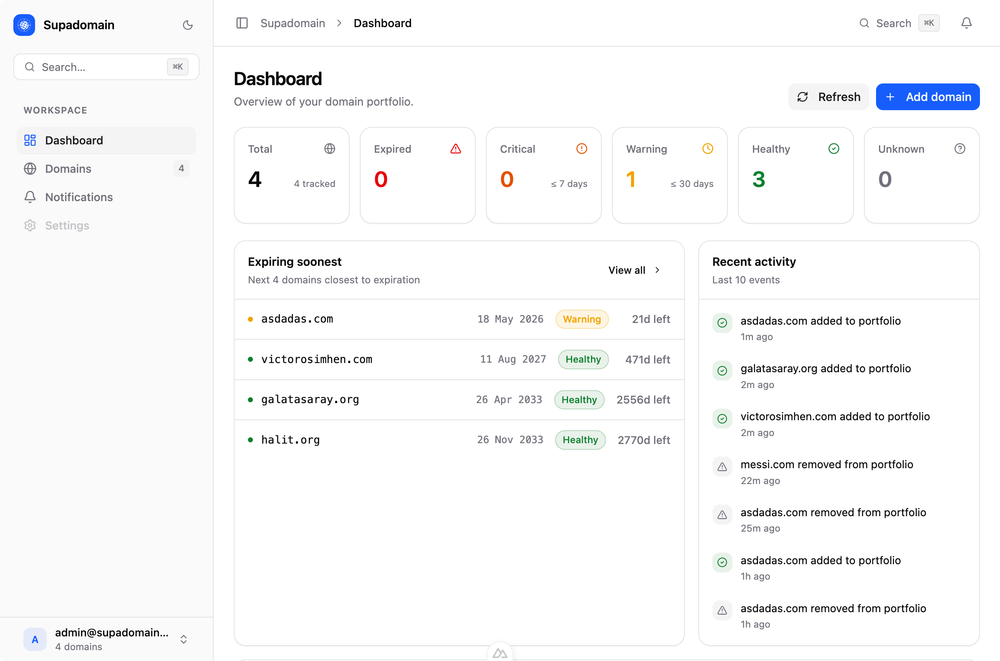

<p align="center">

</br>


<p align="center">
Self-hosted domain expiry monitor<br>
<br/>

</p>
</p>

<p align="center">

</p>

<p align="center">



</p>

- Track domain expiry dates via RDAP queries
- Automatic hourly checks for all monitored domains
- Slack webhook notifications (configurable days before expiry: 30, 7, 1)
- Activity log per domain
- Self-hosted — your data stays in your own MongoDB

<p align="center">

</p>

**Prerequisites:** Node.js 18+ and a MongoDB instance.

```bash
git clone https://github.com/halitsever/supadomain.git
cd supadomain
npm install
cp .env.example .env
```

Fill in `.env`:

```env
MONGODB_URI="mongodb://localhost:27017/supadomain"
NUXT_SESSION_PASSWORD="a-long-random-secret-min-32-chars"
ADMIN_EMAIL="admin@example.com"
ADMIN_PASSWORD="your-secure-password"
```

> If `ADMIN_EMAIL` / `ADMIN_PASSWORD` are not set, a random password is printed to the console on first boot.

```bash
# Development
npm run dev

# Production
npm run build
node .output/server/index.mjs
```

**Slack Notifications**

1. Create an [Incoming Webhook](https://api.slack.com/messaging/webhooks) in your Slack workspace.
2. Go to **Settings → Notifications** in the app and paste the webhook URL.
3. Per-domain thresholds (default: 30, 7, 1 days before expiry) can be customized per domain.

<p align="center">
<a href="https://github.com/halitsever/supadomain/issues">

</a>
</p>

<p align="center">

</p>

<p align="center">

</p>
